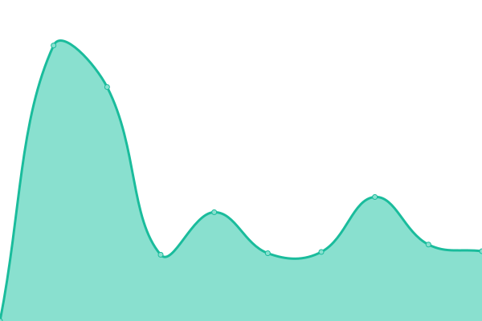
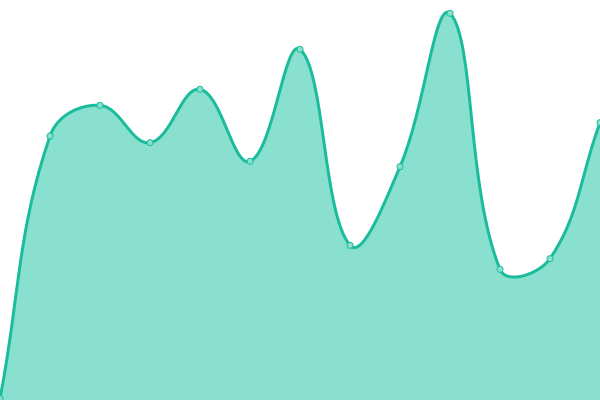
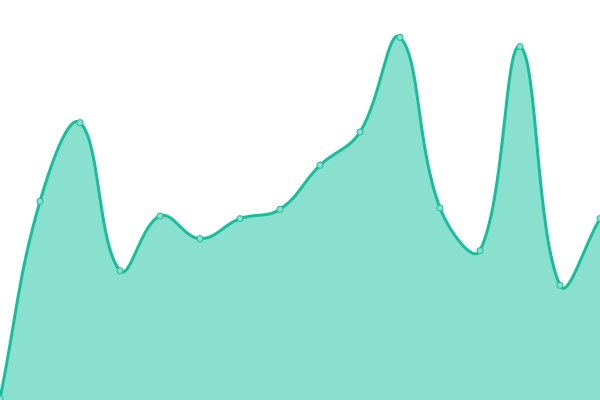
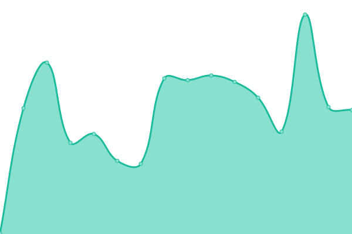
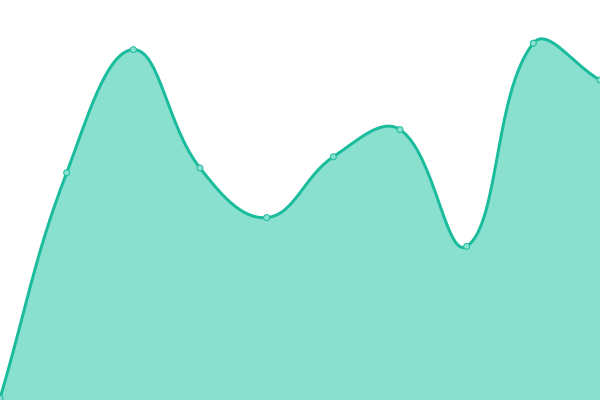

# [📈 Live Status](https://status.kilowott.com): <!--live status--> **All services operational**

This repository contains the open-source uptime monitor and status page for [Kilowott-HQ](https://status.kilowott.com), powered by [Upptime](https://github.com/upptime/upptime).

With [Upptime](https://upptime.js.org), you can get your own unlimited and free uptime monitor and status page, powered entirely by a GitHub repository. We use [Issues](https://github.com/Kilowott-HQ/uptime/issues) as incident reports, [Actions](https://github.com/Kilowott-HQ/uptime/actions) as uptime monitors, and [Pages](https://status.kilowott.com) for the status page.

<!--start: status pages-->
<!-- This summary is generated by Upptime (https://github.com/upptime/upptime) -->
<!-- Do not edit this manually, your changes will be overwritten -->
<!-- prettier-ignore -->
| URL | Status | History | Response Time | Uptime |
| --- | ------ | ------- | ------------- | ------ |
|  [Nordic Fund Day](https://nordicfundday.no/) | 🟩 Up | [nordic-fund-day.yml](https://github.com/Kilowott-HQ/uptime/commits/HEAD/history/nordic-fund-day.yml) | 

 1053ms
     
 | 

<a href="https://Kilowott-HQ.github.io/uptime/history/nordic-fund-day">100.00%</a>
    

|  [Equinavia](https://equinavia.com/) | 🟩 Up | [equinavia.yml](https://github.com/Kilowott-HQ/uptime/commits/HEAD/history/equinavia.yml) | 

 838ms
     
 | 

<a href="https://Kilowott-HQ.github.io/uptime/history/equinavia">100.00%</a>
    

|  [Preikestolen Basecamp](https://preikestolenbasecamp.com/) | 🟩 Up | [preikestolen-basecamp.yml](https://github.com/Kilowott-HQ/uptime/commits/HEAD/history/preikestolen-basecamp.yml) | 

 1496ms
     
 | 

<a href="https://Kilowott-HQ.github.io/uptime/history/preikestolen-basecamp">100.00%</a>
    

|  [Allgrid](https://allgrid.com/) | 🟩 Up | [allgrid.yml](https://github.com/Kilowott-HQ/uptime/commits/HEAD/history/allgrid.yml) | 

 2773ms
     
 | 

<a href="https://Kilowott-HQ.github.io/uptime/history/allgrid">100.00%</a>
    

|  [I Love Pole Buildings](https://ilovepolebuildings.com/) | 🟩 Up | [i-love-pole-buildings.yml](https://github.com/Kilowott-HQ/uptime/commits/HEAD/history/i-love-pole-buildings.yml) | 

 199ms
     
 | 

<a href="https://Kilowott-HQ.github.io/uptime/history/i-love-pole-buildings">100.00%</a>
    

|  [Septic Masters](https://septic-masters.com/) | 🟩 Up | [septic-masters.yml](https://github.com/Kilowott-HQ/uptime/commits/HEAD/history/septic-masters.yml) | 

 158ms
     
 | 

<a href="https://Kilowott-HQ.github.io/uptime/history/septic-masters">100.00%</a>
    

|  [Build a Barn](https://bildabarn.com/) | 🟩 Up | [build-a-barn.yml](https://github.com/Kilowott-HQ/uptime/commits/HEAD/history/build-a-barn.yml) | 

 327ms
     
 | 

<a href="https://Kilowott-HQ.github.io/uptime/history/build-a-barn">100.00%</a>
    

|  [I Trust Quality](https://www.itrustquality.com/) | 🟩 Up | [i-trust-quality.yml](https://github.com/Kilowott-HQ/uptime/commits/HEAD/history/i-trust-quality.yml) | 

 212ms
     
 | 

<a href="https://Kilowott-HQ.github.io/uptime/history/i-trust-quality">100.00%</a>
    

|  [Dryer Vent Guardian](https://dryerventguardian.com/) | 🟩 Up | [dryer-vent-guardian.yml](https://github.com/Kilowott-HQ/uptime/commits/HEAD/history/dryer-vent-guardian.yml) | 

 162ms
     
 | 

<a href="https://Kilowott-HQ.github.io/uptime/history/dryer-vent-guardian">100.00%</a>
    

|  [Call Big Red](https://callbigred.com/) | 🟩 Up | [call-big-red.yml](https://github.com/Kilowott-HQ/uptime/commits/HEAD/history/call-big-red.yml) | 

 806ms
     
 | 

<a href="https://Kilowott-HQ.github.io/uptime/history/call-big-red">100.00%</a>
    

|  [Wood Rock Engineering](https://woodrockengineering.com/) | 🟩 Up | [wood-rock-engineering.yml](https://github.com/Kilowott-HQ/uptime/commits/HEAD/history/wood-rock-engineering.yml) | 

 245ms
     
 | 

<a href="https://Kilowott-HQ.github.io/uptime/history/wood-rock-engineering">100.00%</a>
    

<!--end: status pages-->

[**Visit our status website →**](https://status.kilowott.com)

## 📄 License

- Powered by: [Upptime](https://github.com/upptime/upptime)
- Code: [MIT](./LICENSE) © [Anand Chowdhary](https://anandchowdhary.com), supported by [Pabio](https://pabio.com)
- Data in the `./history` directory: [Open Database License](https://opendatacommons.org/licenses/odbl/1-0/)
