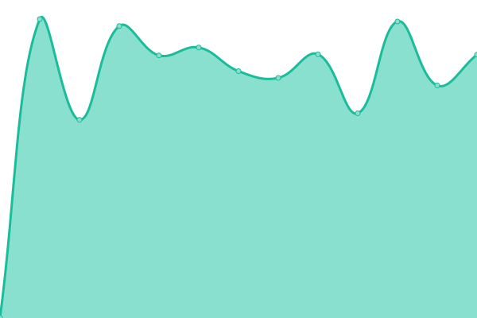
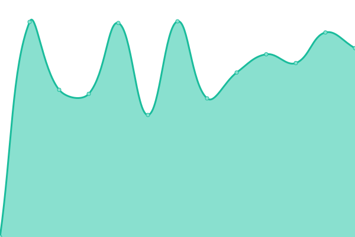
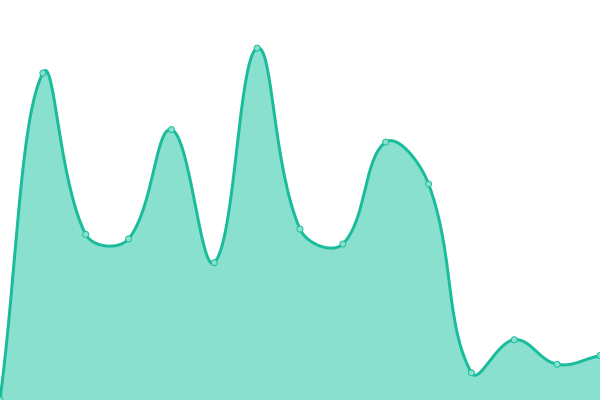
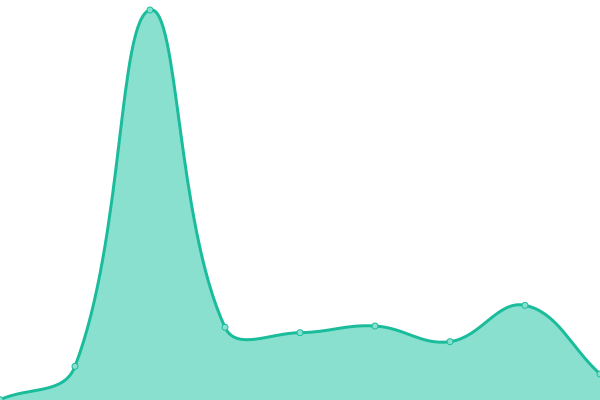
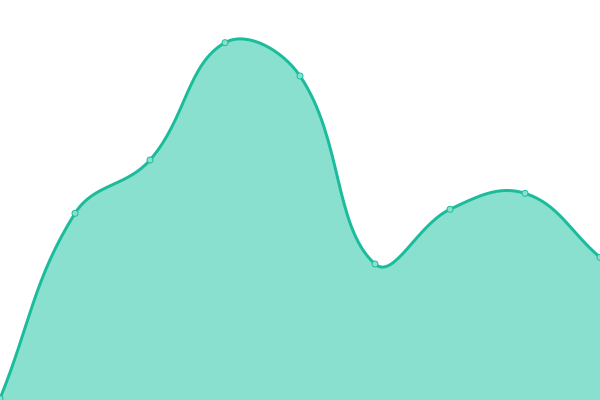
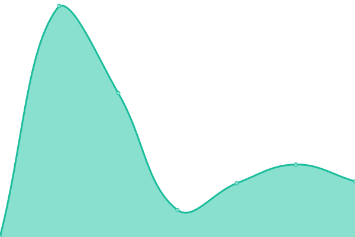

# [📈 Live Status](https://status.kilowott.com): <!--live status--> **🟧 Partial outage**

This repository contains the open-source uptime monitor and status page for [Kilowott-HQ](https://status.kilowott.com), powered by [Upptime](https://github.com/upptime/upptime).

With [Upptime](https://upptime.js.org), you can get your own unlimited and free uptime monitor and status page, powered entirely by a GitHub repository. We use [Issues](https://github.com/Kilowott-HQ/uptime/issues) as incident reports, [Actions](https://github.com/Kilowott-HQ/uptime/actions) as uptime monitors, and [Pages](https://status.kilowott.com) for the status page.

<!--start: status pages-->
<!-- This summary is generated by Upptime (https://github.com/upptime/upptime) -->
<!-- Do not edit this manually, your changes will be overwritten -->
<!-- prettier-ignore -->
| URL | Status | History | Response Time | Uptime |
| --- | ------ | ------- | ------------- | ------ |
|  [Nordic Fund Day](https://nordicfundday.no/) | 🟩 Up | [nordic-fund-day.yml](https://github.com/Kilowott-HQ/uptime/commits/HEAD/history/nordic-fund-day.yml) | 

 1131ms
     
 | 

<a href="https://Kilowott-HQ.github.io/uptime/history/nordic-fund-day">100.00%</a>
    

|  [Equinavia](https://equinavia.com/) | 🟩 Up | [equinavia.yml](https://github.com/Kilowott-HQ/uptime/commits/HEAD/history/equinavia.yml) | 

 299ms
     
 | 

<a href="https://Kilowott-HQ.github.io/uptime/history/equinavia">99.28%</a>
    

|  [Preikestolen Basecamp](https://preikestolenbasecamp.com/) | 🟩 Up | [preikestolen-basecamp.yml](https://github.com/Kilowott-HQ/uptime/commits/HEAD/history/preikestolen-basecamp.yml) | 

 1259ms
     
 | 

<a href="https://Kilowott-HQ.github.io/uptime/history/preikestolen-basecamp">100.00%</a>
    

|  [Allgrid](https://allgrid.com/) | 🟩 Up | [allgrid.yml](https://github.com/Kilowott-HQ/uptime/commits/HEAD/history/allgrid.yml) | 

 3330ms
     
 | 

<a href="https://Kilowott-HQ.github.io/uptime/history/allgrid">100.00%</a>
    

|  [I Love Pole Buildings](https://ilovepolebuildings.com/) | 🟩 Up | [i-love-pole-buildings.yml](https://github.com/Kilowott-HQ/uptime/commits/HEAD/history/i-love-pole-buildings.yml) | 

 142ms
     
 | 

<a href="https://Kilowott-HQ.github.io/uptime/history/i-love-pole-buildings">100.00%</a>
    

|  [Septic Masters](https://septic-masters.com/) | 🟩 Up | [septic-masters.yml](https://github.com/Kilowott-HQ/uptime/commits/HEAD/history/septic-masters.yml) | 

 135ms
     
 | 

<a href="https://Kilowott-HQ.github.io/uptime/history/septic-masters">100.00%</a>
    

|  [Build a Barn](https://bildabarn.com/) | 🟩 Up | [build-a-barn.yml](https://github.com/Kilowott-HQ/uptime/commits/HEAD/history/build-a-barn.yml) | 

 124ms
     
 | 

<a href="https://Kilowott-HQ.github.io/uptime/history/build-a-barn">100.00%</a>
    

|  [I Trust Quality](https://www.itrustquality.com/) | 🟩 Up | [i-trust-quality.yml](https://github.com/Kilowott-HQ/uptime/commits/HEAD/history/i-trust-quality.yml) | 

 408ms
     
 | 

<a href="https://Kilowott-HQ.github.io/uptime/history/i-trust-quality">100.00%</a>
    

|  [Dryer Vent Guardian](https://dryerventguardian.com/) | 🟩 Up | [dryer-vent-guardian.yml](https://github.com/Kilowott-HQ/uptime/commits/HEAD/history/dryer-vent-guardian.yml) | 

 149ms
     
 | 

<a href="https://Kilowott-HQ.github.io/uptime/history/dryer-vent-guardian">100.00%</a>
    

|  [Call Big Red](https://callbigred.com/) | 🟩 Up | [call-big-red.yml](https://github.com/Kilowott-HQ/uptime/commits/HEAD/history/call-big-red.yml) | 

 898ms
     
 | 

<a href="https://Kilowott-HQ.github.io/uptime/history/call-big-red">100.00%</a>
    

|  [Wood Rock Engineering](https://woodrockengineering.com/) | 🟩 Up | [wood-rock-engineering.yml](https://github.com/Kilowott-HQ/uptime/commits/HEAD/history/wood-rock-engineering.yml) | 

 807ms
     
 | 

<a href="https://Kilowott-HQ.github.io/uptime/history/wood-rock-engineering">100.00%</a>
    

|  [Paul John Caffeine](https://pauljohncaffeine.com/) | 🟩 Up | [paul-john-caffeine.yml](https://github.com/Kilowott-HQ/uptime/commits/HEAD/history/paul-john-caffeine.yml) | 

 199ms
     
 | 

<a href="https://Kilowott-HQ.github.io/uptime/history/paul-john-caffeine">92.89%</a>
    

|  [Gutta](https://gutta.no/) | 🟥 Down | [gutta.yml](https://github.com/Kilowott-HQ/uptime/commits/HEAD/history/gutta.yml) | 

 401ms
     
 | 

<a href="https://Kilowott-HQ.github.io/uptime/history/gutta">100.00%</a>
    

|  [Utviklingscoach](https://utviklingscoach.no/) | 🟥 Down | [utviklingscoach.yml](https://github.com/Kilowott-HQ/uptime/commits/HEAD/history/utviklingscoach.yml) | 

 344ms
     
 | 

<a href="https://Kilowott-HQ.github.io/uptime/history/utviklingscoach">100.00%</a>
    

|  [Fomo](https://fomo.no/) | 🟥 Down | [fomo.yml](https://github.com/Kilowott-HQ/uptime/commits/HEAD/history/fomo.yml) | 

 1436ms
     
 | 

<a href="https://Kilowott-HQ.github.io/uptime/history/fomo">100.00%</a>
    

|  [Ways Trafikkskole](https://ways-trafikkskole.no/) | 🟥 Down | [ways-trafikkskole.yml](https://github.com/Kilowott-HQ/uptime/commits/HEAD/history/ways-trafikkskole.yml) | 

 524ms
     
 | 

<a href="https://Kilowott-HQ.github.io/uptime/history/ways-trafikkskole">100.00%</a>
    

|  [Norweh](https://norweh.com/) | 🟩 Up | [norweh.yml](https://github.com/Kilowott-HQ/uptime/commits/HEAD/history/norweh.yml) | 

 627ms
     
 | 

<a href="https://Kilowott-HQ.github.io/uptime/history/norweh">99.80%</a>
    

|  [Norisma](https://norisma.no/) | 🟥 Down | [norisma.yml](https://github.com/Kilowott-HQ/uptime/commits/HEAD/history/norisma.yml) | 

 1671ms
     
 | 

<a href="https://Kilowott-HQ.github.io/uptime/history/norisma">100.00%</a>
    

|  [Norweh Canada](https://norweh.ca/) | 🟩 Up | [norweh-canada.yml](https://github.com/Kilowott-HQ/uptime/commits/HEAD/history/norweh-canada.yml) | 

 764ms
     
 | 

<a href="https://Kilowott-HQ.github.io/uptime/history/norweh-canada">99.90%</a>
    

|  [Coffee Zero NO](https://coffeezero.no/) | 🟥 Down | [coffee-zero-no.yml](https://github.com/Kilowott-HQ/uptime/commits/HEAD/history/coffee-zero-no.yml) | 

 390ms
     
 | 

<a href="https://Kilowott-HQ.github.io/uptime/history/coffee-zero-no">100.00%</a>
    

|  [Coffee Zero SE](https://coffeezero.se/) | 🟥 Down | [coffee-zero-se.yml](https://github.com/Kilowott-HQ/uptime/commits/HEAD/history/coffee-zero-se.yml) | 

 454ms
     
 | 

<a href="https://Kilowott-HQ.github.io/uptime/history/coffee-zero-se">100.00%</a>
    

|  [Tea Zero SE](https://teazero.se/) | 🟥 Down | [tea-zero-se.yml](https://github.com/Kilowott-HQ/uptime/commits/HEAD/history/tea-zero-se.yml) | 

 518ms
     
 | 

<a href="https://Kilowott-HQ.github.io/uptime/history/tea-zero-se">100.00%</a>
    

|  [Menakur NO](https://menakur.no/) | 🟥 Down | [menakur-no.yml](https://github.com/Kilowott-HQ/uptime/commits/HEAD/history/menakur-no.yml) | 

 886ms
     
 | 

<a href="https://Kilowott-HQ.github.io/uptime/history/menakur-no">100.00%</a>
    

|  [Menakur SE](https://menakur.se/) | 🟥 Down | [menakur-se.yml](https://github.com/Kilowott-HQ/uptime/commits/HEAD/history/menakur-se.yml) | 

 907ms
     
 | 

<a href="https://Kilowott-HQ.github.io/uptime/history/menakur-se">100.00%</a>
    

|  [Betakaroten NO](https://betakaroten.no/) | 🟥 Down | [betakaroten-no.yml](https://github.com/Kilowott-HQ/uptime/commits/HEAD/history/betakaroten-no.yml) | 

 350ms
     
 | 

<a href="https://Kilowott-HQ.github.io/uptime/history/betakaroten-no">100.00%</a>
    

|  [Betakaroten SE](https://betakaroten.se/) | 🟥 Down | [betakaroten-se.yml](https://github.com/Kilowott-HQ/uptime/commits/HEAD/history/betakaroten-se.yml) | 

 395ms
     
 | 

<a href="https://Kilowott-HQ.github.io/uptime/history/betakaroten-se">100.00%</a>
    

|  [Norisma SE](https://norisma.se/) | 🟥 Down | [norisma-se.yml](https://github.com/Kilowott-HQ/uptime/commits/HEAD/history/norisma-se.yml) | 

 1463ms
     
 | 

<a href="https://Kilowott-HQ.github.io/uptime/history/norisma-se">100.00%</a>
    

|  [CakeMyDay](https://cakemyday.ai/) | 🟩 Up | [cake-my-day.yml](https://github.com/Kilowott-HQ/uptime/commits/HEAD/history/cake-my-day.yml) | 

 1661ms
     
 | 

<a href="https://Kilowott-HQ.github.io/uptime/history/cake-my-day">100.00%</a>
    

|  [Insynk](https://insynk.no/) | 🟥 Down | [insynk.yml](https://github.com/Kilowott-HQ/uptime/commits/HEAD/history/insynk.yml) | 

 229ms
     
 | 

<a href="https://Kilowott-HQ.github.io/uptime/history/insynk">100.00%</a>
    

|  [Aloe Vera Shop](https://aloeverashop.no/) | 🟥 Down | [aloe-vera-shop.yml](https://github.com/Kilowott-HQ/uptime/commits/HEAD/history/aloe-vera-shop.yml) | 

 272ms
     
 | 

<a href="https://Kilowott-HQ.github.io/uptime/history/aloe-vera-shop">100.00%</a>
    

|  [Unfluenser](https://unfluenser.no/) | 🟥 Down | [unfluenser.yml](https://github.com/Kilowott-HQ/uptime/commits/HEAD/history/unfluenser.yml) | 

 1962ms
     
 | 

<a href="https://Kilowott-HQ.github.io/uptime/history/unfluenser">100.00%</a>
    

|  [Vingtor](https://www.vingtor.no/) | 🟩 Up | [vingtor.yml](https://github.com/Kilowott-HQ/uptime/commits/HEAD/history/vingtor.yml) | 

 623ms
     
 | 

<a href="https://Kilowott-HQ.github.io/uptime/history/vingtor">99.31%</a>
    

|  [Hotel Continental](https://hotelcontinental.no/) | 🟥 Down | [hotel-continental.yml](https://github.com/Kilowott-HQ/uptime/commits/HEAD/history/hotel-continental.yml) | 

 851ms
     
 | 

<a href="https://Kilowott-HQ.github.io/uptime/history/hotel-continental">100.00%</a>
    

|  [Gutta Fra Havet](https://guttafrahavet.no/) | 🟥 Down | [gutta-fra-havet.yml](https://github.com/Kilowott-HQ/uptime/commits/HEAD/history/gutta-fra-havet.yml) | 

 1221ms
     
 | 

<a href="https://Kilowott-HQ.github.io/uptime/history/gutta-fra-havet">100.00%</a>
    

|  [Coo](https://coo.no/) | 🟩 Up | [coo.yml](https://github.com/Kilowott-HQ/uptime/commits/HEAD/history/coo.yml) | 

 1211ms
     
 | 

<a href="https://Kilowott-HQ.github.io/uptime/history/coo">99.90%</a>
    

<!--end: status pages-->

[**Visit our status website →**](https://status.kilowott.com)

## 📄 License

- Powered by: [Upptime](https://github.com/upptime/upptime)
- Code: [MIT](./LICENSE) © [Anand Chowdhary](https://anandchowdhary.com), supported by [Pabio](https://pabio.com)
- Data in the `./history` directory: [Open Database License](https://opendatacommons.org/licenses/odbl/1-0/)
