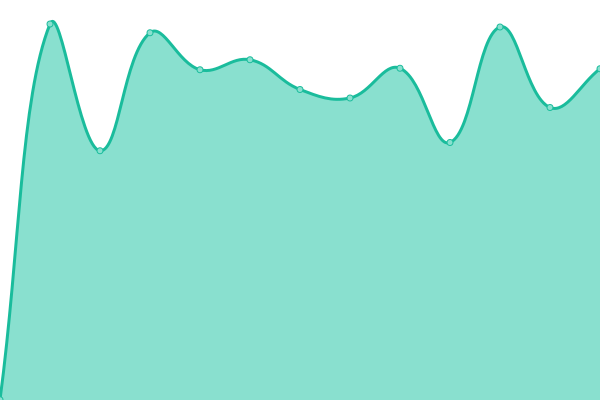
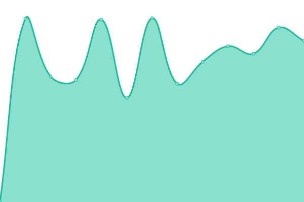
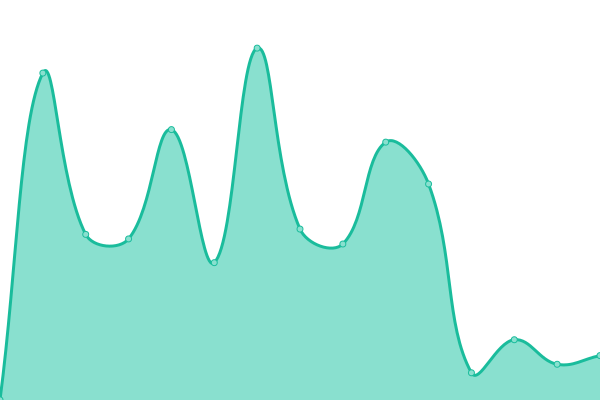
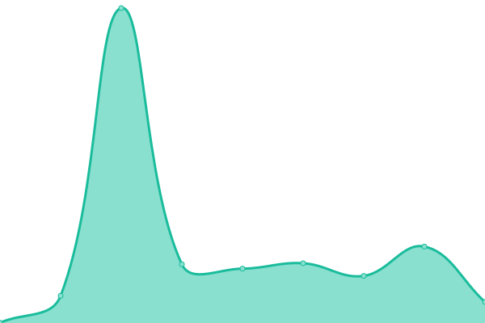
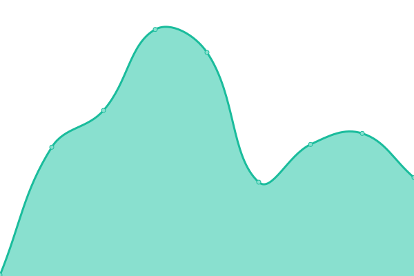

# [📈 Live Status](https://status.kilowott.com): <!--live status--> **🟧 Partial outage**

This repository contains the open-source uptime monitor and status page for [Kilowott-HQ](https://status.kilowott.com), powered by [Upptime](https://github.com/upptime/upptime).

With [Upptime](https://upptime.js.org), you can get your own unlimited and free uptime monitor and status page, powered entirely by a GitHub repository. We use [Issues](https://github.com/Kilowott-HQ/uptime/issues) as incident reports, [Actions](https://github.com/Kilowott-HQ/uptime/actions) as uptime monitors, and [Pages](https://status.kilowott.com) for the status page.

<!--start: status pages-->
<!-- This summary is generated by Upptime (https://github.com/upptime/upptime) -->
<!-- Do not edit this manually, your changes will be overwritten -->
<!-- prettier-ignore -->
| URL | Status | History | Response Time | Uptime |
| --- | ------ | ------- | ------------- | ------ |
|  [Nordic Fund Day](https://nordicfundday.no/) | 🟩 Up | [nordic-fund-day.yml](https://github.com/Kilowott-HQ/uptime/commits/HEAD/history/nordic-fund-day.yml) | 

 1995ms
     
 | 

<a href="https://Kilowott-HQ.github.io/uptime/history/nordic-fund-day">100.00%</a>
    

|  [Preikestolen Basecamp](https://preikestolenbasecamp.com/) | 🟩 Up | [preikestolen-basecamp.yml](https://github.com/Kilowott-HQ/uptime/commits/HEAD/history/preikestolen-basecamp.yml) | 

 1306ms
     
 | 

<a href="https://Kilowott-HQ.github.io/uptime/history/preikestolen-basecamp">100.00%</a>
    

|  [Allgrid](https://allgrid.com/) | 🟩 Up | [allgrid.yml](https://github.com/Kilowott-HQ/uptime/commits/HEAD/history/allgrid.yml) | 

 4072ms
     
 | 

<a href="https://Kilowott-HQ.github.io/uptime/history/allgrid">70.86%</a>
    

|  [I Love Pole Buildings](https://ilovepolebuildings.com/) | 🟩 Up | [i-love-pole-buildings.yml](https://github.com/Kilowott-HQ/uptime/commits/HEAD/history/i-love-pole-buildings.yml) | 

 218ms
     
 | 

<a href="https://Kilowott-HQ.github.io/uptime/history/i-love-pole-buildings">100.00%</a>
    

|  [Septic Masters](https://septic-masters.com/) | 🟩 Up | [septic-masters.yml](https://github.com/Kilowott-HQ/uptime/commits/HEAD/history/septic-masters.yml) | 

 197ms
     
 | 

<a href="https://Kilowott-HQ.github.io/uptime/history/septic-masters">100.00%</a>
    

|  [Build a Barn](https://bildabarn.com/) | 🟩 Up | [build-a-barn.yml](https://github.com/Kilowott-HQ/uptime/commits/HEAD/history/build-a-barn.yml) | 

 336ms
     
 | 

<a href="https://Kilowott-HQ.github.io/uptime/history/build-a-barn">0.00%</a>
    

|  [I Trust Quality](https://www.itrustquality.com/) | 🟩 Up | [i-trust-quality.yml](https://github.com/Kilowott-HQ/uptime/commits/HEAD/history/i-trust-quality.yml) | 

 560ms
     
 | 

<a href="https://Kilowott-HQ.github.io/uptime/history/i-trust-quality">100.00%</a>
    

|  [Dryer Vent Guardian](https://dryerventguardian.com/) | 🟩 Up | [dryer-vent-guardian.yml](https://github.com/Kilowott-HQ/uptime/commits/HEAD/history/dryer-vent-guardian.yml) | 

 191ms
     
 | 

<a href="https://Kilowott-HQ.github.io/uptime/history/dryer-vent-guardian">100.00%</a>
    

|  [Call Big Red](https://callbigred.com/) | 🟩 Up | [call-big-red.yml](https://github.com/Kilowott-HQ/uptime/commits/HEAD/history/call-big-red.yml) | 

 966ms
     
 | 

<a href="https://Kilowott-HQ.github.io/uptime/history/call-big-red">100.00%</a>
    

|  [Wood Rock Engineering](https://woodrockengineering.com/) | 🟩 Up | [wood-rock-engineering.yml](https://github.com/Kilowott-HQ/uptime/commits/HEAD/history/wood-rock-engineering.yml) | 

 202ms
     
 | 

<a href="https://Kilowott-HQ.github.io/uptime/history/wood-rock-engineering">100.00%</a>
    

|  [Norweh](https://norweh.com/) | 🟩 Up | [norweh.yml](https://github.com/Kilowott-HQ/uptime/commits/HEAD/history/norweh.yml) | 

 477ms
     
 | 

<a href="https://Kilowott-HQ.github.io/uptime/history/norweh">100.00%</a>
    

|  [Norweh Canada](https://norweh.ca/) | 🟩 Up | [norweh-canada.yml](https://github.com/Kilowott-HQ/uptime/commits/HEAD/history/norweh-canada.yml) | 

 491ms
     
 | 

<a href="https://Kilowott-HQ.github.io/uptime/history/norweh-canada">100.00%</a>
    

|  [CakeMyDay](https://cakemyday.ai/) | 🟩 Up | [cake-my-day.yml](https://github.com/Kilowott-HQ/uptime/commits/HEAD/history/cake-my-day.yml) | 

 1169ms
     
 | 

<a href="https://Kilowott-HQ.github.io/uptime/history/cake-my-day">100.00%</a>
    

|  [Coo](https://coo.no/) | 🟥 Down | [coo.yml](https://github.com/Kilowott-HQ/uptime/commits/HEAD/history/coo.yml) | 

 1188ms
     
 | 

<a href="https://Kilowott-HQ.github.io/uptime/history/coo">15.61%</a>
    

|  [Basecamp Explorer](https://basecampexplorer.com/) | 🟩 Up | [basecamp-explorer.yml](https://github.com/Kilowott-HQ/uptime/commits/HEAD/history/basecamp-explorer.yml) | 

 1042ms
     
 | 

<a href="https://Kilowott-HQ.github.io/uptime/history/basecamp-explorer">100.00%</a>
    

|  [TUF International](https://tuf-international.com/) | 🟩 Up | [tuf-international.yml](https://github.com/Kilowott-HQ/uptime/commits/HEAD/history/tuf-international.yml) | 

 1234ms
     
 | 

<a href="https://Kilowott-HQ.github.io/uptime/history/tuf-international">100.00%</a>
    

|  [Auto 8-8](https://www.auto8-8.no/) | 🟩 Up | [auto-8-8.yml](https://github.com/Kilowott-HQ/uptime/commits/HEAD/history/auto-8-8.yml) | 

 322ms
     
 | 

<a href="https://Kilowott-HQ.github.io/uptime/history/auto-8-8">100.00%</a>
    

|  [Mackinnon Construction](https://www.mackinnonconstruction.com/) | 🟩 Up | [mackinnon-construction.yml](https://github.com/Kilowott-HQ/uptime/commits/HEAD/history/mackinnon-construction.yml) | 

 793ms
     
 | 

<a href="https://Kilowott-HQ.github.io/uptime/history/mackinnon-construction">100.00%</a>
    

|  [Company Outing AI](https://www.companyouting.ai/) | 🟩 Up | [company-outing-ai.yml](https://github.com/Kilowott-HQ/uptime/commits/HEAD/history/company-outing-ai.yml) | 

 1013ms
     
 | 

<a href="https://Kilowott-HQ.github.io/uptime/history/company-outing-ai">100.00%</a>
    

|  [Premium NW](https://premiumnw.com/) | 🟩 Up | [premium-nw.yml](https://github.com/Kilowott-HQ/uptime/commits/HEAD/history/premium-nw.yml) | 

 291ms
     
 | 

<a href="https://Kilowott-HQ.github.io/uptime/history/premium-nw">25.12%</a>
    

|  [Bakken Landscape](https://www.bakkenlandscape.com/) | 🟩 Up | [bakken-landscape.yml](https://github.com/Kilowott-HQ/uptime/commits/HEAD/history/bakken-landscape.yml) | 

 841ms
     
 | 

<a href="https://Kilowott-HQ.github.io/uptime/history/bakken-landscape">100.00%</a>
    

|  [iGROW Agency](https://igrowagency.com/) | 🟩 Up | [i-grow-agency.yml](https://github.com/Kilowott-HQ/uptime/commits/HEAD/history/i-grow-agency.yml) | 

 293ms
     
 | 

<a href="https://Kilowott-HQ.github.io/uptime/history/i-grow-agency">100.00%</a>
    

|  [Industrisalg](https://industrisalg.no/) | 🟩 Up | [industrisalg.yml](https://github.com/Kilowott-HQ/uptime/commits/HEAD/history/industrisalg.yml) | 

 757ms
     
 | 

<a href="https://Kilowott-HQ.github.io/uptime/history/industrisalg">0.00%</a>
    

<!--end: status pages-->

[**Visit our status website →**](https://status.kilowott.com)

## 📄 License

- Powered by: [Upptime](https://github.com/upptime/upptime)
- Code: [MIT](./LICENSE) © [Anand Chowdhary](https://anandchowdhary.com), supported by [Pabio](https://pabio.com)
- Data in the `./history` directory: [Open Database License](https://opendatacommons.org/licenses/odbl/1-0/)
