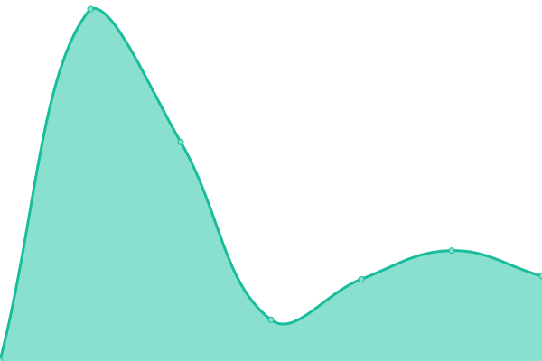

# [📈 Live Status](https://status.kilowott.com): <!--live status--> **🟧 Partial outage**

This repository contains the open-source uptime monitor and status page for [Kilowott-HQ](https://status.kilowott.com), powered by [Upptime](https://github.com/upptime/upptime).

With [Upptime](https://upptime.js.org), you can get your own unlimited and free uptime monitor and status page, powered entirely by a GitHub repository. We use [Issues](https://github.com/Kilowott-HQ/uptime/issues) as incident reports, [Actions](https://github.com/Kilowott-HQ/uptime/actions) as uptime monitors, and [Pages](https://status.kilowott.com) for the status page.

<!--start: status pages-->
<!-- This summary is generated by Upptime (https://github.com/upptime/upptime) -->
<!-- Do not edit this manually, your changes will be overwritten -->
<!-- prettier-ignore -->
| URL | Status | History | Response Time | Uptime |
| --- | ------ | ------- | ------------- | ------ |
|  [Nordic Fund Day](https://nordicfundday.no/) | 🟩 Up | [nordic-fund-day.yml](https://github.com/Kilowott-HQ/uptime/commits/HEAD/history/nordic-fund-day.yml) | 

 2136ms
     
 | 

<a href="https://Kilowott-HQ.github.io/uptime/history/nordic-fund-day">100.00%</a>
    

|  [Preikestolen Basecamp](https://preikestolenbasecamp.com/) | 🟩 Up | [preikestolen-basecamp.yml](https://github.com/Kilowott-HQ/uptime/commits/HEAD/history/preikestolen-basecamp.yml) | 

 1313ms
     
 | 

<a href="https://Kilowott-HQ.github.io/uptime/history/preikestolen-basecamp">100.00%</a>
    

|  [Allgrid](https://allgrid.com/) | 🟩 Up | [allgrid.yml](https://github.com/Kilowott-HQ/uptime/commits/HEAD/history/allgrid.yml) | 

 1829ms
     
 | 

<a href="https://Kilowott-HQ.github.io/uptime/history/allgrid">100.00%</a>
    

|  [I Love Pole Buildings](https://ilovepolebuildings.com/) | 🟩 Up | [i-love-pole-buildings.yml](https://github.com/Kilowott-HQ/uptime/commits/HEAD/history/i-love-pole-buildings.yml) | 

 215ms
     
 | 

<a href="https://Kilowott-HQ.github.io/uptime/history/i-love-pole-buildings">100.00%</a>
    

|  [Septic Masters](https://septic-masters.com/) | 🟩 Up | [septic-masters.yml](https://github.com/Kilowott-HQ/uptime/commits/HEAD/history/septic-masters.yml) | 

 210ms
     
 | 

<a href="https://Kilowott-HQ.github.io/uptime/history/septic-masters">100.00%</a>
    

|  [Build a Barn](https://bildabarn.com/) | 🟩 Up | [build-a-barn.yml](https://github.com/Kilowott-HQ/uptime/commits/HEAD/history/build-a-barn.yml) | 

 471ms
     
 | 

<a href="https://Kilowott-HQ.github.io/uptime/history/build-a-barn">0.09%</a>
    

|  [I Trust Quality](https://www.itrustquality.com/) | 🟩 Up | [i-trust-quality.yml](https://github.com/Kilowott-HQ/uptime/commits/HEAD/history/i-trust-quality.yml) | 

 530ms
     
 | 

<a href="https://Kilowott-HQ.github.io/uptime/history/i-trust-quality">100.00%</a>
    

|  [Dryer Vent Guardian](https://dryerventguardian.com/) | 🟩 Up | [dryer-vent-guardian.yml](https://github.com/Kilowott-HQ/uptime/commits/HEAD/history/dryer-vent-guardian.yml) | 

 200ms
     
 | 

<a href="https://Kilowott-HQ.github.io/uptime/history/dryer-vent-guardian">100.00%</a>
    

|  [Call Big Red](https://callbigred.com/) | 🟩 Up | [call-big-red.yml](https://github.com/Kilowott-HQ/uptime/commits/HEAD/history/call-big-red.yml) | 

 957ms
     
 | 

<a href="https://Kilowott-HQ.github.io/uptime/history/call-big-red">100.00%</a>
    

|  [Wood Rock Engineering](https://woodrockengineering.com/) | 🟩 Up | [wood-rock-engineering.yml](https://github.com/Kilowott-HQ/uptime/commits/HEAD/history/wood-rock-engineering.yml) | 

 190ms
     
 | 

<a href="https://Kilowott-HQ.github.io/uptime/history/wood-rock-engineering">100.00%</a>
    

|  [Paul John Caffeine](https://pauljohncaffeine.com/) | 🟥 Down | [paul-john-caffeine.yml](https://github.com/Kilowott-HQ/uptime/commits/HEAD/history/paul-john-caffeine.yml) | 

 433ms
     
 | 

<a href="https://Kilowott-HQ.github.io/uptime/history/paul-john-caffeine">100.00%</a>
    

|  [Gutta](https://gutta.no/) | 🟥 Down | [gutta.yml](https://github.com/Kilowott-HQ/uptime/commits/HEAD/history/gutta.yml) | 

 739ms
     
 | 

<a href="https://Kilowott-HQ.github.io/uptime/history/gutta">100.00%</a>
    

|  [Utviklingscoach](https://utviklingscoach.no/) | 🟩 Up | [utviklingscoach.yml](https://github.com/Kilowott-HQ/uptime/commits/HEAD/history/utviklingscoach.yml) | 

 247ms
     
 | 

<a href="https://Kilowott-HQ.github.io/uptime/history/utviklingscoach">100.00%</a>
    

|  [Fomo](https://fomo.no/) | 🟩 Up | [fomo.yml](https://github.com/Kilowott-HQ/uptime/commits/HEAD/history/fomo.yml) | 

 1131ms
     
 | 

<a href="https://Kilowott-HQ.github.io/uptime/history/fomo">28.83%</a>
    

|  [Ways Trafikkskole](https://ways-trafikkskole.no/) | 🟩 Up | [ways-trafikkskole.yml](https://github.com/Kilowott-HQ/uptime/commits/HEAD/history/ways-trafikkskole.yml) | 

 731ms
     
 | 

<a href="https://Kilowott-HQ.github.io/uptime/history/ways-trafikkskole">100.00%</a>
    

|  [Norweh](https://norweh.com/) | 🟩 Up | [norweh.yml](https://github.com/Kilowott-HQ/uptime/commits/HEAD/history/norweh.yml) | 

 539ms
     
 | 

<a href="https://Kilowott-HQ.github.io/uptime/history/norweh">100.00%</a>
    

|  [Norisma](https://norisma.no/) | 🟩 Up | [norisma.yml](https://github.com/Kilowott-HQ/uptime/commits/HEAD/history/norisma.yml) | 

 610ms
     
 | 

<a href="https://Kilowott-HQ.github.io/uptime/history/norisma">100.00%</a>
    

|  [Norweh Canada](https://norweh.ca/) | 🟩 Up | [norweh-canada.yml](https://github.com/Kilowott-HQ/uptime/commits/HEAD/history/norweh-canada.yml) | 

 534ms
     
 | 

<a href="https://Kilowott-HQ.github.io/uptime/history/norweh-canada">100.00%</a>
    

|  [Coffee Zero NO](https://coffeezero.no/) | 🟩 Up | [coffee-zero-no.yml](https://github.com/Kilowott-HQ/uptime/commits/HEAD/history/coffee-zero-no.yml) | 

 420ms
     
 | 

<a href="https://Kilowott-HQ.github.io/uptime/history/coffee-zero-no">100.00%</a>
    

|  [Coffee Zero SE](https://coffeezero.se/) | 🟩 Up | [coffee-zero-se.yml](https://github.com/Kilowott-HQ/uptime/commits/HEAD/history/coffee-zero-se.yml) | 

 410ms
     
 | 

<a href="https://Kilowott-HQ.github.io/uptime/history/coffee-zero-se">100.00%</a>
    

|  [Tea Zero SE](https://teazero.se/) | 🟩 Up | [tea-zero-se.yml](https://github.com/Kilowott-HQ/uptime/commits/HEAD/history/tea-zero-se.yml) | 

 449ms
     
 | 

<a href="https://Kilowott-HQ.github.io/uptime/history/tea-zero-se">100.00%</a>
    

|  [Menakur NO](https://menakur.no/) | 🟩 Up | [menakur-no.yml](https://github.com/Kilowott-HQ/uptime/commits/HEAD/history/menakur-no.yml) | 

 235ms
     
 | 

<a href="https://Kilowott-HQ.github.io/uptime/history/menakur-no">100.00%</a>
    

|  [Menakur SE](https://menakur.se/) | 🟩 Up | [menakur-se.yml](https://github.com/Kilowott-HQ/uptime/commits/HEAD/history/menakur-se.yml) | 

 259ms
     
 | 

<a href="https://Kilowott-HQ.github.io/uptime/history/menakur-se">100.00%</a>
    

|  [Betakaroten NO](https://betakaroten.no/) | 🟩 Up | [betakaroten-no.yml](https://github.com/Kilowott-HQ/uptime/commits/HEAD/history/betakaroten-no.yml) | 

 418ms
     
 | 

<a href="https://Kilowott-HQ.github.io/uptime/history/betakaroten-no">100.00%</a>
    

|  [Betakaroten SE](https://betakaroten.se/) | 🟩 Up | [betakaroten-se.yml](https://github.com/Kilowott-HQ/uptime/commits/HEAD/history/betakaroten-se.yml) | 

 324ms
     
 | 

<a href="https://Kilowott-HQ.github.io/uptime/history/betakaroten-se">100.00%</a>
    

|  [Norisma SE](https://norisma.se/) | 🟩 Up | [norisma-se.yml](https://github.com/Kilowott-HQ/uptime/commits/HEAD/history/norisma-se.yml) | 

 560ms
     
 | 

<a href="https://Kilowott-HQ.github.io/uptime/history/norisma-se">100.00%</a>
    

|  [CakeMyDay](https://cakemyday.ai/) | 🟩 Up | [cake-my-day.yml](https://github.com/Kilowott-HQ/uptime/commits/HEAD/history/cake-my-day.yml) | 

 1034ms
     
 | 

<a href="https://Kilowott-HQ.github.io/uptime/history/cake-my-day">100.00%</a>
    

|  [Insynk](https://insynk.no/) | 🟩 Up | [insynk.yml](https://github.com/Kilowott-HQ/uptime/commits/HEAD/history/insynk.yml) | 

 332ms
     
 | 

<a href="https://Kilowott-HQ.github.io/uptime/history/insynk">100.00%</a>
    

|  [Aloe Vera Shop](https://aloeverashop.no/) | 🟩 Up | [aloe-vera-shop.yml](https://github.com/Kilowott-HQ/uptime/commits/HEAD/history/aloe-vera-shop.yml) | 

 265ms
     
 | 

<a href="https://Kilowott-HQ.github.io/uptime/history/aloe-vera-shop">100.00%</a>
    

|  [Unfluenser](https://unfluenser.no/) | 🟩 Up | [unfluenser.yml](https://github.com/Kilowott-HQ/uptime/commits/HEAD/history/unfluenser.yml) | 

 1005ms
     
 | 

<a href="https://Kilowott-HQ.github.io/uptime/history/unfluenser">100.00%</a>
    

|  [Vingtor](https://www.vingtor.no/) | 🟩 Up | [vingtor.yml](https://github.com/Kilowott-HQ/uptime/commits/HEAD/history/vingtor.yml) | 

 688ms
     
 | 

<a href="https://Kilowott-HQ.github.io/uptime/history/vingtor">100.00%</a>
    

|  [Hotel Continental](https://hotelcontinental.no/) | 🟩 Up | [hotel-continental.yml](https://github.com/Kilowott-HQ/uptime/commits/HEAD/history/hotel-continental.yml) | 

 651ms
     
 | 

<a href="https://Kilowott-HQ.github.io/uptime/history/hotel-continental">100.00%</a>
    

|  [Gutta Fra Havet](https://guttafrahavet.no/) | 🟩 Up | [gutta-fra-havet.yml](https://github.com/Kilowott-HQ/uptime/commits/HEAD/history/gutta-fra-havet.yml) | 

 1112ms
     
 | 

<a href="https://Kilowott-HQ.github.io/uptime/history/gutta-fra-havet">100.00%</a>
    

|  [Coo](https://coo.no/) | 🟩 Up | [coo.yml](https://github.com/Kilowott-HQ/uptime/commits/HEAD/history/coo.yml) | 

 1035ms
     
 | 

<a href="https://Kilowott-HQ.github.io/uptime/history/coo">30.53%</a>
    

|  [Basecamp Explorer](https://basecampexplorer.com/) | 🟩 Up | [basecamp-explorer.yml](https://github.com/Kilowott-HQ/uptime/commits/HEAD/history/basecamp-explorer.yml) | 

 1035ms
     
 | 

<a href="https://Kilowott-HQ.github.io/uptime/history/basecamp-explorer">100.00%</a>
    

|  [TUF International](https://tuf-international.com/) | 🟩 Up | [tuf-international.yml](https://github.com/Kilowott-HQ/uptime/commits/HEAD/history/tuf-international.yml) | 

 1377ms
     
 | 

<a href="https://Kilowott-HQ.github.io/uptime/history/tuf-international">100.00%</a>
    

|  [Auto 8-8](https://www.auto8-8.no/) | 🟩 Up | [auto-8-8.yml](https://github.com/Kilowott-HQ/uptime/commits/HEAD/history/auto-8-8.yml) | 

 339ms
     
 | 

<a href="https://Kilowott-HQ.github.io/uptime/history/auto-8-8">100.00%</a>
    

|  [Mackinnon Construction](https://www.mackinnonconstruction.com/) | 🟩 Up | [mackinnon-construction.yml](https://github.com/Kilowott-HQ/uptime/commits/HEAD/history/mackinnon-construction.yml) | 

 780ms
     
 | 

<a href="https://Kilowott-HQ.github.io/uptime/history/mackinnon-construction">100.00%</a>
    

|  [Models Goa](https://modelsgoa.com/) | 🟩 Up | [models-goa.yml](https://github.com/Kilowott-HQ/uptime/commits/HEAD/history/models-goa.yml) | 

 1862ms
     
 | 

<a href="https://Kilowott-HQ.github.io/uptime/history/models-goa">100.00%</a>
    

|  [Company Outing AI](https://www.companyouting.ai/) | 🟩 Up | [company-outing-ai.yml](https://github.com/Kilowott-HQ/uptime/commits/HEAD/history/company-outing-ai.yml) | 

 976ms
     
 | 

<a href="https://Kilowott-HQ.github.io/uptime/history/company-outing-ai">100.00%</a>
    

|  [Premium NW](https://premiumnw.com/) | 🟩 Up | [premium-nw.yml](https://github.com/Kilowott-HQ/uptime/commits/HEAD/history/premium-nw.yml) | 

 355ms
     
 | 

<a href="https://Kilowott-HQ.github.io/uptime/history/premium-nw">54.93%</a>
    

|  [Bakken Landscape](https://www.bakkenlandscape.com/) | 🟩 Up | [bakken-landscape.yml](https://github.com/Kilowott-HQ/uptime/commits/HEAD/history/bakken-landscape.yml) | 

 623ms
     
 | 

<a href="https://Kilowott-HQ.github.io/uptime/history/bakken-landscape">100.00%</a>
    

|  [iGROW Agency](https://igrowagency.com/) | 🟩 Up | [i-grow-agency.yml](https://github.com/Kilowott-HQ/uptime/commits/HEAD/history/i-grow-agency.yml) | 

 297ms
     
 | 

<a href="https://Kilowott-HQ.github.io/uptime/history/i-grow-agency">100.00%</a>
    

|  [CT Hone](https://www.cthone.com/) | 🟩 Up | [ct-hone.yml](https://github.com/Kilowott-HQ/uptime/commits/HEAD/history/ct-hone.yml) | 

 198ms
     
 | 

<a href="https://Kilowott-HQ.github.io/uptime/history/ct-hone">100.00%</a>
    

|  [Industrisalg](https://industrisalg.no/) | 🟩 Up | [industrisalg.yml](https://github.com/Kilowott-HQ/uptime/commits/HEAD/history/industrisalg.yml) | 

 816ms
     
 | 

<a href="https://Kilowott-HQ.github.io/uptime/history/industrisalg">52.80%</a>
    

|  [XL Storkjøkken](https://xl-storkjokken.no/) | 🟩 Up | [xl-storkjokken.yml](https://github.com/Kilowott-HQ/uptime/commits/HEAD/history/xl-storkjokken.yml) | 

 539ms
     
 | 

<a href="https://Kilowott-HQ.github.io/uptime/history/xl-storkjokken">100.00%</a>
    

|  [Poke Party](https://pokeparty.no/) | 🟩 Up | [poke-party.yml](https://github.com/Kilowott-HQ/uptime/commits/HEAD/history/poke-party.yml) | 

 619ms
     
 | 

<a href="https://Kilowott-HQ.github.io/uptime/history/poke-party">100.00%</a>
    

|  [Aurora Green Genesis](https://auroragreengenesis.com/) | 🟩 Up | [aurora-green-genesis.yml](https://github.com/Kilowott-HQ/uptime/commits/HEAD/history/aurora-green-genesis.yml) | 

 373ms
     
 | 

<a href="https://Kilowott-HQ.github.io/uptime/history/aurora-green-genesis">100.00%</a>
    

<!--end: status pages-->

[**Visit our status website →**](https://status.kilowott.com)

## 📄 License

- Powered by: [Upptime](https://github.com/upptime/upptime)
- Code: [MIT](./LICENSE) © [Anand Chowdhary](https://anandchowdhary.com), supported by [Pabio](https://pabio.com)
- Data in the `./history` directory: [Open Database License](https://opendatacommons.org/licenses/odbl/1-0/)
